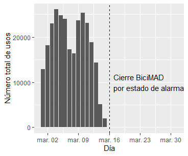
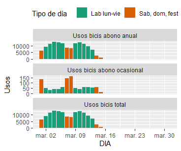

# Actividades

## dplyr avanzado

### group_by

1. ¿Qué le ocurre al data.frame starwars cuando hacemos group_by(starwars, sex)?

2. ¿Ves alguna diferencia entre starwars y group_by(starwars, sex)?

3. ¿Cuántos grupos se han creado?

### Operaciones agrupadas

1. Cuenta cuantos personajes (filas) hay para cada uno de los valores de la columna `sex` en el data.frame starwars

2. Consulta la ayuda de la función count. Cómo podríamos reescribir el ejercicio anterior usando esta función?

### Operaciones en múltiples columnas

#### Ejercicio 1

1. Calcula la media, máximo y mínimo de las columnas “height”, “mass” y “birth_year” del dataframe starwars. ¿Por qué obtenemos NA como resultado?

2. Consultar la ayuda de la función across para ver como se pueden pasar argumentos extra a las funciones que aplicamos en across

3. Modificar la solución de 1) para ignorar NAs

#### Ejercicio 2

Dado el código que vimos en otro ejercicio para contar el número de personajes para cada uno de los valores de la columna sex:

```{r}
starwars %>%
    group_by(sex) %>%
    summarize(n = n())
```

Modificar este código para que se calcule además la media, máximo y mínimo de las columnas “height”, “mass” y “birth_year”.

### Joins

1. Hacer un join de los data.frames band_members y band_instruments2 por las columnas name y artist respectivamente. El resultado tiene que tener tantas filas como valores distintos de las columnas “name” y “artist”

2. ¿Aparecen valores que son NA en el resultado? ¿Por qué?

## ggplot2 avanzado

### Facetas

Dado el siguiente código que importa un fichero de Excel en R visto en uno de los ejercicios anteriores:

```{r}
library(readxl)

bicis <- read_excel('./data/bicis_usos_acumulado.xls',
                    sheet = "Usos mar 2020",
                    range = "A3:E34")
```

1. Pivotar las columnas “Usos bicis abono anual”, “Usos bicis abono ocasional” y “Usos bicis total” para convertirlas en 2: “Tipo_uso” y “Usos”. Tipo_uso tendrás los valores “Usos bicis abono anual”, “Usos bicis abono ocasional” y “Usos bicis total”, mientras que “Usos” contiene los datos numéricos

2. Sobre los datos que se han creado en el apartado 2, realizar el siguiente gráfico de barras:
   - Eje x: días
   - Eje y: número de usos
   - Color de las barras: tipo de dia
   - Un sub-gráfico para cada uno de los 3 tipos de uso
   
3. ¿Que problema tiene el gráfico para usuarios ocasionales? Experimentar con distintos valores de los parámetros `scale` y `ncol`.

### Ejes

Usando el dataframe `bicis_long` del ejercicio anterior, realizamos el siguiente gráfico:

```{r}
ggplot(bicis_long, aes(x = DIA, y = Usos)) + geom_col()
```

Sobre el gráfico anterior:

1. Añadir una línea vertical rayada (tipo de línea “dashed”) en el día 16 de Marzo

2. Añadir una anotación textual en las coordenadas x = día 17 de Marzo e y = 10000, con el mensaje: "Cierre BiciMAD por estado de alarma". Justificar el texto a la izquierda

3. Cambiar las etiquetas del eje x por “Días” y del eje y por “Número total de usos”.

Este sería el resultado final:



### Estilos

Dado el siguiente gráfico que se genera a partir del dataframe `bicis`:

```{r}
ggplot(bicis_long, aes(x = DIA, y = Usos, fill = `Tipo de día`)) +
  geom_col() +
  facet_wrap(~ Tipo_uso, ncol = 1, scales = "free_y")
```

1. Mover la escala del Tipo de día a la parte superior

2. Cambiar la paleta de colores por “Dark2”, disponible en la web www.colorbrewer2.org (qualitative)

Este sería el gráfico resultante:


